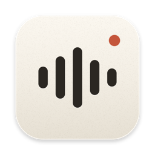
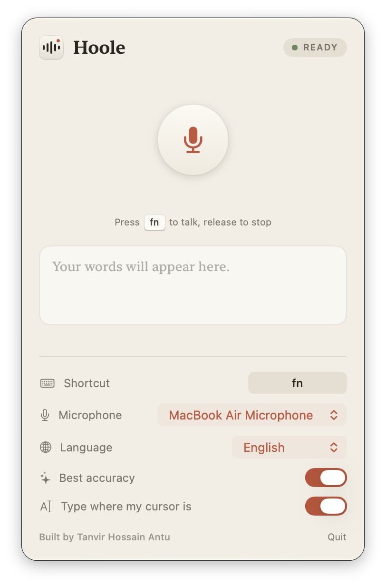

<p align="center">
  
</p>

<h1 align="center">Hoole</h1>

<p align="center">
  <b>Press <kbd>fn</kbd> to talk. Release to stop. Your words are typed wherever your cursor is.</b><br>
  Free, open-source dictation for the Mac.
</p>

<h3 align="center">🔒 100% offline. Your voice never leaves your Mac.</h3>

<p align="center">
  No internet, no account, no cloud, no tracking.<br>
  Speech recognition runs entirely on your Mac, so it works on a plane, in a basement, or with Wi-Fi switched off.
</p>

<p align="center">
  🇬🇧 🇧🇩 🇮🇳 🇪🇸 🇫🇷 🇩🇪 🇸🇦 🇨🇳 🇯🇵 🇰🇷 🇷🇺 🇧🇷 🇹🇷 🇵🇰 🇮🇩 🇮🇹<br>
  <a href="#supported-languages"><b>100 languages supported</b></a>
</p>

<p align="center">
  
</p>

<p align="center">
  
</p>

---

## Why Hoole

- **Works fully offline:** once installed, Hoole never needs the internet. There's no server to send your voice to; the speech model lives inside the app. Turn off Wi-Fi and it works exactly the same.
- **Types for you, anywhere:** Notes, Slack, Mail, your browser, the terminal. If there's a cursor, Hoole can type there.
- **Press to talk, release to stop:** press and hold **fn** while you speak; release it and Hoole types what you said.
- **Private by design:** no account, no analytics, nothing uploaded. Ever.
- **Very accurate:** Hoole uses a large, high-quality speech model that gets names, punctuation and fast speech right. A typical sentence is typed about a second after you release the key.
- **Your shortcut:** **fn** by default, or pick your own: a single key like **F5**, a combo like **⌥ Space**, or keys held together like **A + Space**.
- **About 100 languages:** English by default, plus Bengali, Hindi, Urdu, Arabic, Chinese, Japanese, Spanish, French, German and many more, or let Hoole detect the language. (Accuracy is best for widely spoken languages, English especially.)
- **Live mode too:** turn off *Best accuracy* and words are typed live while you talk, using a smaller, faster model (7 languages).
- **No time limit:** talk for as long as you like.

## Supported languages

**With Best accuracy on (the default): 100 languages.** Pick one in the Language menu, or choose Auto-detect.

| | | | |
|---|---|---|---|
| 🇿🇦 Afrikaans | 🇦🇱 Albanian | 🇪🇹 Amharic | 🇸🇦 Arabic |
| 🇦🇲 Armenian | 🇮🇳 Assamese | 🇦🇿 Azerbaijani | 🇷🇺 Bashkir |
| 🇪🇸 Basque | 🇧🇾 Belarusian | 🇧🇩 Bengali | 🇧🇦 Bosnian |
| 🇫🇷 Breton | 🇧🇬 Bulgarian | 🇭🇰 Cantonese | 🇦🇩 Catalan |
| 🇨🇳 Chinese | 🇭🇷 Croatian | 🇨🇿 Czech | 🇩🇰 Danish |
| 🇳🇱 Dutch | 🇬🇧 English | 🇪🇪 Estonian | 🇫🇴 Faroese |
| 🇫🇮 Finnish | 🇫🇷 French | 🇪🇸 Galician | 🇬🇪 Georgian |
| 🇩🇪 German | 🇬🇷 Greek | 🇮🇳 Gujarati | 🇭🇹 Haitian Creole |
| 🇳🇬 Hausa | 🇺🇸 Hawaiian | 🇮🇱 Hebrew | 🇮🇳 Hindi |
| 🇭🇺 Hungarian | 🇮🇸 Icelandic | 🇮🇩 Indonesian | 🇮🇹 Italian |
| 🇯🇵 Japanese | 🇮🇩 Javanese | 🇮🇳 Kannada | 🇰🇿 Kazakh |
| 🇰🇭 Khmer | 🇰🇷 Korean | 🇱🇦 Lao | 🌐 Latin |
| 🇱🇻 Latvian | 🇨🇩 Lingala | 🇱🇹 Lithuanian | 🇱🇺 Luxembourgish |
| 🇲🇰 Macedonian | 🇲🇬 Malagasy | 🇲🇾 Malay | 🇮🇳 Malayalam |
| 🇲🇹 Maltese | 🇳🇿 Maori | 🇮🇳 Marathi | 🇲🇳 Mongolian |
| 🇲🇲 Myanmar | 🇳🇵 Nepali | 🇳🇴 Norwegian | 🇳🇴 Nynorsk |
| 🇫🇷 Occitan | 🇦🇫 Pashto | 🇮🇷 Persian | 🇵🇱 Polish |
| 🇵🇹 Portuguese | 🇮🇳 Punjabi | 🇷🇴 Romanian | 🇷🇺 Russian |
| 🌐 Sanskrit | 🇷🇸 Serbian | 🇿🇼 Shona | 🇵🇰 Sindhi |
| 🇱🇰 Sinhala | 🇸🇰 Slovak | 🇸🇮 Slovenian | 🇸🇴 Somali |
| 🇪🇸 Spanish | 🇮🇩 Sundanese | 🇹🇿 Swahili | 🇸🇪 Swedish |
| 🇵🇭 Tagalog | 🇹🇯 Tajik | 🇱🇰 Tamil | 🇷🇺 Tatar |
| 🇮🇳 Telugu | 🇹🇭 Thai | 🌐 Tibetan | 🇹🇷 Turkish |
| 🇹🇲 Turkmen | 🇺🇦 Ukrainian | 🇵🇰 Urdu | 🇺🇿 Uzbek |
| 🇻🇳 Vietnamese | 🇬🇧 Welsh | 🌐 Yiddish | 🇳🇬 Yoruba |

**With Best accuracy off (live typing): 7 languages.** 🇬🇧 English · 🇩🇪 German · 🇫🇷 French · 🇪🇸 Spanish · 🇮🇹 Italian · 🇳🇱 Dutch · 🇵🇱 Polish

> Flags show a country where each language is widely spoken; 🌐 marks languages without a single home country. Accuracy is highest for widely spoken languages, English especially.

## Requirements

- A Mac with **Apple Silicon** (M1, M2, M3, M4 or later)
- **macOS 14 Sonoma** or newer
- About 1 GB of disk space, and about 1 GB of memory while Hoole is running (8 GB of RAM or more recommended)

## Install

### Option A: Download (easiest)

1. Download **Hoole.dmg** (about 850 MB, since the speech models are included) from the [latest release](https://github.com/antu7/hoole/releases/latest).
2. Open it and drag **Hoole** into **Applications**.
3. Open Hoole from Applications. macOS will say it *can't verify the developer*. That's expected: Hoole is a free app and isn't registered with Apple. To open it anyway:
   - Click **Done** on the warning.
   - Go to **System Settings → Privacy & Security**, scroll down to *"Hoole was blocked…"*, and click **Open Anyway**.
   - Enter your password and click **Open**.

   Or, if you're comfortable with Terminal, run this once instead:
   ```sh
   xattr -dr com.apple.quarantine /Applications/Hoole.app
   ```

You only need to do this the first time. Then continue with [First launch](#first-launch-allow-two-permissions).

### Option B: Build from source

It takes a couple of minutes and you don't need any programming experience.

**1. Install Apple's command line tools** (skip if you already have them). Open **Terminal** (press ⌘ Space, type *Terminal*, press Return) and run:

```sh
xcode-select --install
```

Click **Install** in the window that appears and wait for it to finish.

**2. Download and build Hoole:**

```sh
git clone https://github.com/antu7/hoole.git
cd hoole
./scripts/build.sh
```

The first build downloads the speech models (about 900 MB in total), so it takes a few minutes depending on your connection.

> **One-time password prompt:** on the first build, macOS asks for your password to trust a local signing certificate called "Hoole Local Signing". This lets macOS remember Hoole's permissions when you update or rebuild. If you skip it, Hoole still works, but macOS will ask for permissions again after every rebuild.

**3. Move it to your Applications folder and open it:**

```sh
cp -R build/Hoole.app /Applications/
open /Applications/Hoole.app
```

Hoole lives in your **menu bar** at the top of the screen, as a small waveform icon. It has no Dock icon.

## First launch: allow two permissions

Click the Hoole icon in the menu bar. If anything is missing, you'll see an **Allow** button for it:

| Permission | Why Hoole needs it |
|---|---|
| **Microphone** | To hear you. |
| **Accessibility** | To notice your shortcut and type the text at your cursor. |

For Accessibility, macOS opens **System Settings → Privacy & Security → Accessibility**. Switch **Hoole** on there. You only have to do this once.

## How to use

1. Click into any text field: a message, a document, a search box, a terminal.
2. **Press and hold <kbd>fn</kbd> to talk.** A small bar at the bottom of the screen shows that Hoole is listening, with a live preview of your words.
3. **Release <kbd>fn</kbd> to stop listening.** About a second later, your words are typed where your cursor was.

Want to keep going? Press <kbd>fn</kbd> again; Hoole adds a space and continues your sentence.

> **Tip:** if pressing <kbd>fn</kbd> also opens the emoji picker or switches your keyboard language, go to **System Settings → Keyboard** and set **"Press 🌐 key to"** to **Do Nothing**. No fn key on your keyboard? Pick another shortcut in Hoole's settings.

### Settings (click the menu bar icon)

| Setting | What it does |
|---|---|
| **Shortcut** | Click it, then press the key or keys you want and let go. Esc cancels. |
| **Microphone** | Choose which mic to use: built-in, AirPods, a USB mic, and so on. |
| **Language** | English by default. With *Best accuracy* on, choose from about 100 languages (Bengali, Hindi, Arabic, Chinese, …); with it off, from 7. Or Auto-detect. |
| **Best accuracy** | On by default: Hoole types your words right after you release the key, as accurately as possible. Off: words are typed live while you talk, a little less accurately. |
| **Type where my cursor is** | Turn this off to have Hoole copy text to the clipboard instead of typing it. |
| **Recent** | Your last few dictations. Click one to copy it again. |

You can also click the big microphone button to start and stop recording without the shortcut.

## Tips and troubleshooting

**Nothing gets typed.** Open the menu bar window and check:
- No **Allow** buttons are showing (both permissions are on).
- The right **Microphone** is selected. AirPods in their case, or a muted headset, send silence. If Hoole hears nothing, the bottom bar says *"No sound from the mic"*.

**My shortcut stopped typing a letter.** If your shortcut includes a key that normally types something (like **A + Space** or **⇧** alone), that key can't type normally while Hoole is running. Hoole warns you when you pick one. Shortcuts with **fn**, **⌥**, **⌃** or **⌘** avoid this.

**Hoole typed words I didn't say.** In a very quiet room, background noise is sometimes heard as a short phrase. Press <kbd>fn</kbd> only while you're speaking.

**I want to start fresh.** Click **Clear** next to *Recent* to delete your history.

## Updating

**Installed from the DMG?** Quit Hoole, download the newest `Hoole.dmg` from [Releases](https://github.com/antu7/hoole/releases), and drag it into Applications, replacing the old one. Your settings and permissions carry over.

**Built from source?**

```sh
cd hoole
git pull
./scripts/build.sh
cp -R build/Hoole.app /Applications/
```

Quit Hoole first (menu bar icon → **Quit**), then open it again after copying.

## Uninstalling

1. Quit Hoole from the menu bar.
2. Delete **Hoole** from your Applications folder.
3. Optionally, remove it from **System Settings → Privacy & Security → Accessibility** and **Microphone**.

## Privacy

Hoole works **100% offline**. It contains no networking code at all: no servers, no accounts, no analytics, no updates checking in the background.

It records audio only while you press your shortcut (or after you click the record button). The audio is turned into text on your Mac and then thrown away. Your recent dictations are stored only on your Mac, and **Clear** deletes them.

The internet is used just once: to download Hoole (or, if you build from source, to fetch the speech model during the first build).

## Making a release build

```sh
./scripts/build.sh --dmg   # creates build/Hoole.dmg
```

## License

MIT © [Tanvir Hossain Antu](https://github.com/antu7). Third-party components included in the app are listed in [THIRD_PARTY_LICENSES](THIRD_PARTY_LICENSES).
